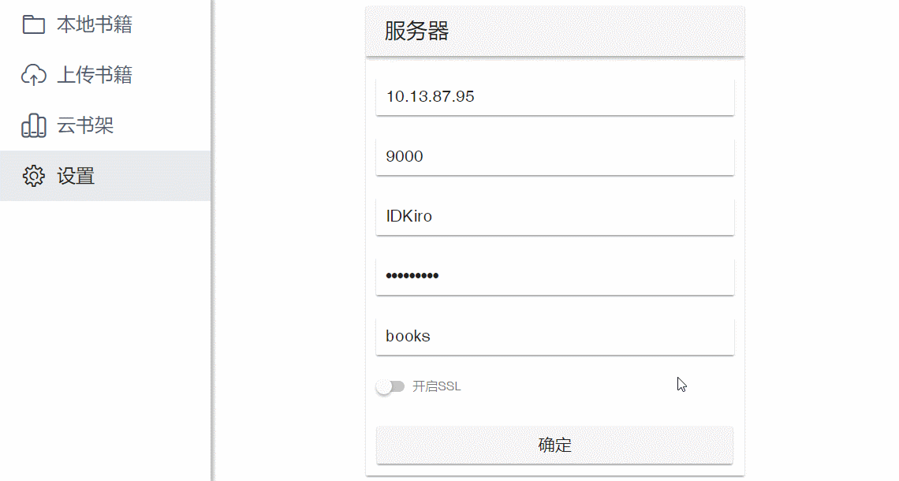

# PixReader

> 应用还在开发中，这里提供初版的[demo](http://book.idkiro.xyz/)，如果有需要，这是前期开发的[笔记](/docs/notebook/README.md)。

> 这里提供可用于测试的设置：

```
服务器地址: 176.122.140.215
端口: 9000  
用户名: minio
密码: miniokey
文件夹: upload
开启SSL: false
```

## 应用截图



## 使用方法

当前版本仅支持[minio](https://github.com/minio/minio)。

输入下面的指令，在你的服务器上搭建私人 minio 对象存储服务。

Docker:

```
docker run -p 9000:9000 --name minio1 \
  -e "MINIO_ACCESS_KEY=username" \
  -e "MINIO_SECRET_KEY=password" \
  -v /mnt/data:/data \
  -v /mnt/config:/root/.minio \
  minio/minio server /data
```

Binary:

```
wget https://dl.minio.io/server/minio/release/linux-amd64/minio
chmod +x minio
export MINIO_ACCESS_KEY=username
export MINIO_SECRET_KEY=password
(./minio server ./data &)
```

打开 `服务器地址:端口` 即可访问搭建的 minio 服务，当前需要你自己在网页端创建 bucket 并修改 bucket 的权限。

## TODO

- [x] 移动设备支持
- [ ] 其他云服务支持
- [ ] 多语言支持
- [ ] 偏好设置
- [ ] 桌面应用
- [ ] 移动应用